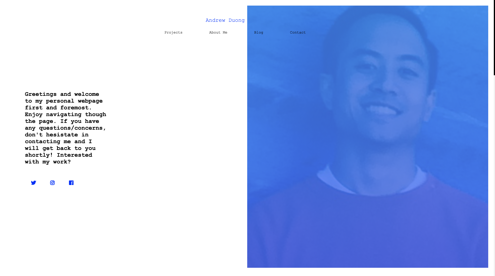

# Title: Backended Portfolio
## Site Picture:


## Technologies Used:
- HTML: Used to create needed object elements 
- jQuery: Allowed me to dynamically create elements that could be appended/prepended to the html files
- JavaScript: Used in the HTLM files and JS files
- FontAwesome: Used logos/images from their website to make my webpage more animate with the help of CSS as well.
- Bootstrap: Navbar, button(s) and form were mainly used with the help of the resources of Bootstrap's preset codes
- CSS: Used to make to make the styling of the background image and colors & sizes
- Git: Used to document the changes of the source code
- GitHub: Used to create the repository for the html and css in which that can be pushed to GitHub domain
- NPM Express: Currently I only have the NPM package of express for this repository but plan on adding mySQL or mongoDB as my server connection to my contacts page very soon

## Summary:
In my updated portfolio, I was able to manage in using Bootstrap, Media Queries, and jquery to create my portfolio webpage. Using the mainly the .on, .onscroll .scrollTop, .animate and the .hash DOM event handles were a huge proponent in getting my portfolio page to me all within one webpage instead of creating separate pages for my about me, projects, blog/journal and contact pages. And for the vistors to scroll up and down the webpage smoothly using the .hash & .animate DOM methods specifically.

## Demo Link:
https://limitless-headland-03015.herokuapp.com

## Getting Started:
The simpliest way in seeing a demo of my Backended Portfolio is to click on the Heroku demo link right above that leads it directly to the project without any installations required. This link can be found within this readme file or at the description area within https://github.com/duongsters/backend-porfolio

To connect locally...
1) Clone my backended Potfolio repository via https://github.com/duongsters/backend-porfolio
2) Run command line Terminal (or via Gitbash) 'npm install' for required NPMS used within the application...or just download all NPMs from Technologies Used below.
3) Run command line 'node server.js' to start up the application
4) Once connected to http://localhost:8080/ from CLI, copy that exact link to URL
5) Run 'ctrl + c' within the CLI to exit the application entirely


## Code Snippet(s):
via server.js:
* This code snippet from my server.js file is shown to show how this coding will allow to connect to my htmlRoutes.js folder to handle the heroku deployment and the ability to connect on the localhost port 8080 if the heroku link to my portfolio fails.
```javascript
var express = require("express");

var app = express();

var PORT = process.env.PORT || 8080;

app.use(express.urlencoded({ extended: false }));
app.use(express.json());
app.use(express.static("public"));

require("./routes/htmlRoutes")(app);

app.listen(PORT, function() {
    console.log("App listening on PORT: " + PORT);
});

```

via htmlRoutes.js:
* The code below was simply made without any other routes due to the fact that my portfolio is all within a single html route file of index.html. If I were to have seperated my sections of my portfolio to seperate html files, I would have had more html route calls to each portion (ie. "About Me", "My Porfolio", "Contact Me", etc). So the snippet below just runs when there is no matching route outside of index.html '/' root route--then it will push the user back to the default to home '/' route.

```javascript
var path = require("path");
module.exports = function(app) {

    app.get("*", function(req, res){
        res.sendFile(path.join(__dirname, "../public/index.html"));
    });
};
```


## Author Links:
- [GitHub](https://github.com/duongsters)
- [linkedIn](https://www.linkedin.com/in/theandrewduong/)
- [Portfolio](https://limitless-headland-03015.herokuapp.com)
